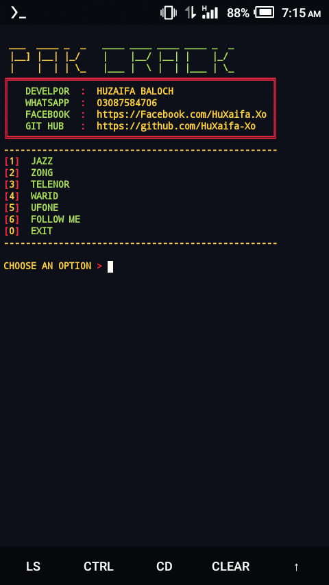

 

# Installation :

`😈 apt update`

`😈 apt upgrade`

`😈 apt install git`

`😈 pkg install python`

`😈 pkg install python2 -y`

`😈 pip2 install requests`

`😈 pip2 install mechanize`

`😈 git clone https://github.com/HuXaifa-Xo/Pak-Crack`

`😈 cd Ishfaq`

👾 `python2 Huzaifa.py`
😜`Username : Huzaifa`
😜`Password : Huzaifa`
